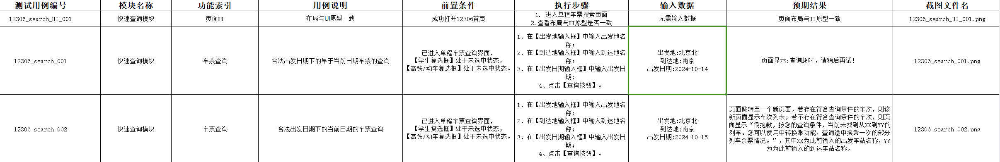
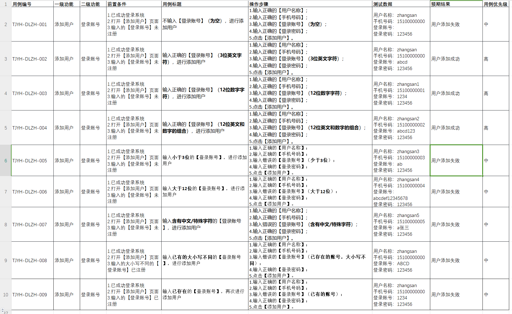
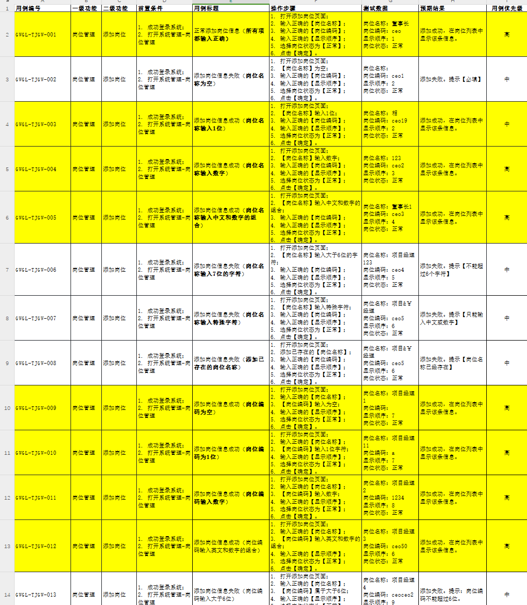

1. 为什么车票查询是五个，因为这是边界值，比如时间区间是[5,12]，那么5之前，5,5-12中间任意，12,12以后，这样就是五个
2. 哪怕是学生票高铁票的前置条件，这两项也必须是未选中的状态，因为这是在做这项事之前的准备工作
3. 因为可能一个站点有很多的选择，因此在这里车票需要加上回车键确定，这样才能保证输入的正确性。并且在测试需求文档中测试范围内写明了**输入框键入输入值并回车的方式**
4. 测试需求文档：标题中出现的**12306**单程车票**快速查询模块**测试需求文档，就是测试用例中的模块名称，并且快速查询模块中查询是关键，因此**12306_search**就是测试用例编号抬头，在测试范围内给了四个范围，普通车票就可以没有附加值，学生票、动车高铁、动车高铁学生就可以有附加值：student、gd、student_gd，功能索引填写在测试目的中出现最多的词语比如**车票查询**

   | 测试用例编号 | 模块名称 | 功能索引 | 用例说明         | 前置条件                                                    | 执行步骤                                   | 输入数据   | 预期结果 | 截图文件名       |
   | ------------ | -------- | -------- | ---------------- | ----------------------------------------------------------- | ------------------------------------------ | ---------- | -------- | ---------------- |
   |              |          |          | 是当前用例的概述 | 1.成功进入xx页面；2.xxx处于xx状态，【】或者对**关键字加粗** | 分条说明**完整实现**这条用例要经过哪些步骤 | 加粗、分条 | 对预期的 | 测试用例编号.png |

   
5. 第一项永远填写冒烟用例，也就是什么也不做检查页面完整性
6. 一定要切记，在12306中虽然过早的日期不能直接在弹出框中选中（前端会做校验），**但是可以使用sendKeys输入不合法的值**！！
7. 按照需求说明书来，而不是需求文档
8. 虽然被测软件名\_功能模块名\_附加说明(可选)\_三位数编号，但是附加说明可以是多条，比如：student_gd
9. 先看测试需求文档，再看功能说明书

一些其他的测试用例文档：

1. 
2. 
3. 开vpn可以访问chatgpt，但是加载国内的网页就特别慢